# leaflet-arrowheads
 Leaflet-Arrowheads is a small plugin for leaflet to quickly draw arrowheads on polylines for vector visualization.

<p align="center">
  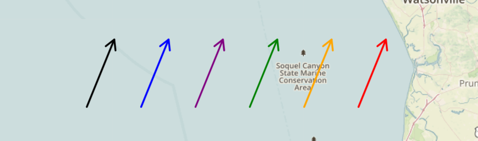
</p>

## [:eyes: DEMO :eyes:](https://codesandbox.io/s/leaflet-arrowheads-example-zfxxc)

## Installation

Leaflet-Arrowheads compatible with leaflet 1.5.1+.  It has 2 dependencies: [Leaflet](https://leafletjs.com/) itself, and [Leaflet GeometryUtil](https://github.com/makinacorpus/Leaflet.GeometryUtil).

You can use npm to install leaflet-arrowheads:

````
npm install leaflet-arrowheads --save
````

Then you can simply import its content into your project:

````javascript
import 'leaflet-arrowheads'
````

### Without ES6 Imports

Grab the [source file](https://github.com/slutske22/leaflet-arrowheads/blob/master/src/leaflet-arrowheads.js) and include it in your project.  You can include the source file in your header, but it must come *after* a link to  [Leaflet GeometryUtil](https://github.com/makinacorpus/Leaflet.GeometryUtil), which must come *after* a link to the leaflet source.  Your main project javascript will come after this, like so:

````html
<head>
  <script src="https://unpkg.com/leaflet@1.6.0/dist/leaflet.js"></script>
  <script src=".../scripts/leaflet.geometryutil.js"></script>
  <script src=".../scripts/leaflet-arrowheads.js"></script>
  <script src=".../yourProjectScript.js" defer></script>
</head>
````

## Usage

Arrowheads can be applied to any polyline, whether unisegmental, multisegmental, continuous, or discontinuous:

````javascript
var myVector = L.polyline([ coords ]).arrowheads()
````

Arrowheads will be added to your polyline and will automatically be added to and removed from the map when you call add and remove methods on your polyline:

````javascript
myVector.addTo(map) or myVector.remove()
````

If you need to access the arrowheads directly, you can call the `.getArrowheads()` method on your polyline.

````javascript
myVector.getArrowheads() // returns the arrowheads polyline object
myVector.getArrowheads().remove() // removes arrowheads from map
````

Arrowheads can also be deleted from their parent polyline entirely:

````javascript
myVector.deleteArrowheads()
````

Arrowheads can take a configuration object as its argument:

````javascript
var myVector = L.polyline([ coords ]).arrowheads({ <Options> })
````

You can also use arrowheads on a GeoJSON that contains `LineString` or `MultiLineString` features by adding it as an option:

````javascript
var myGeoJson = L.geoJSON(geoJsonData, { arrowheads: { <Options> } })
````


## Options

Arrowheads offers a variety of options for rendering and styling arrowheads.  See the options table below.<br>
<br>
Arrowheads inherit all options from [L.Path](https://leafletjs.com/reference-1.6.0.html#path).  Arrowheads also inherit all options from their parent polylines, except `fill`, `fillOpacity`, and `smoothFactor`.  These can be changed manually when defining the arrowheads' options, but changing smoothFactor will result in improperly rendered arrows.<br>
<br>
<table>

   <tr>
      <td> <b> Option </b> </td>
      <td> <b> Type </b> </td>
      <td> <b> Default </b> </td>
      <td> <b> Description </b> </td>
   </tr>

   <tr>
      <td> yawn </td>
      <td> Number <i color="grey"> ( Degrees ) </i> </td>
      <td> 60 </td>
      <td>  Defines the width of the opening of the arrowhead, given in degrees.  The larger the angle, the wider the arrowhead. </td>
   </tr>

   <tr>
      <td> size </td>
      <td width="25%"> Number | String <br>
      <i> ( Meters | Percent or Pixels ) </i> </td>
      <td> '15%' </td>
      <td> Determines the size of the arrowhead.  Accepts three types of values: <br>
         <ul>
            <li> A number will set the size of the arrowhead to that number of meters </li>
            <li> A string value which is a number with a percent sign <i>( '15%', '20%', '25%', etc. )</i> will render arrows whose size is that percentage of the size of the parent polyline.  If the polyline has multiple segments, 'size' will take the percent of the average size of the segments. </li>
            <li> A string value which is a number with the suffix 'px' <i>( '20px', '25px', '30px', etc. )</i> will render an arrowhead whose size stays at a constant pixel value, regardless of zoom level.  Will look strange at low zoom levels or for smaller parent vectors.  Ideal for larger parent vectors and at higher zoom levels. </li>
         </ul>
      </td>
   </tr>

   <tr>
      <td> frequency </td>
      <td> Number | String <br>
      <i> ( Number of arrowheads | Meters, Pixels, 'allvertices', 'endonly' ) </i> </td>
      <td> 'allvertices' </td>
      <td> How many arrowheads are rendered on a polyline.  
         <ul>
            <li> 'allvertices' renders an arrowhead on each vertex. </li>
            <li> 'endonly' renders only one at the end.</li>
            <li> A number value renders that number of arrowheads evenly spaces across the polyline.  </li>
            <li>  A string value with suffix 'm' (i.e. <code>'100m'</code>) will render arrowheads spaced evenly along the polyline with roughly that many meters between each one.  </li>
            <li>A string value with suffix 'px' (i.e. <code>'30px'</code>) will render arrowheads spaced evenly with roughly that many pixels between each, regardless of zoom level.</li>
         </ul>
      </td>
   </tr>

   <tr>
      <td> proportionalToTotal </td>
      <td> Boolean </td>
      <td> false </td>
      <td> Only relevant when <code>size</code> is given as a percent. Useful when <code>frequency</code> is set to <code>'endonly'</code>.  Will render the arrowhead(s) with a size proportional to the entire length of the multi-segmented polyline, rather than proportional to the average length of all the segments.</td>
   </tr>

</table>


## Examples

A demo project is available for viewing at https://codesandbox.io/s/leaflet-arrowheads-example-zfxxc.
The web page alone without the code: https://zfxxc.csb.app/

Polylines in this demo have popups which each contain the code for that polyline.  Click around, and feel free to look through the codesandbox for more detail.

<table>
   <tr>
      <td colspan="4"><b>Yawn Options</td>
   </tr>
   <tr>
      <td width="35%">
         <pre>L.polyline([]).arrowheads()</pre>
         (Standard option gives 60 degree yawn)
      </td>
      <td>
         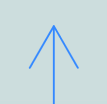
      </td>
      <td width="35%">
         <pre>L.polyline([]).arrowheads({
  yawn: 90
})</pre>
      </td>
      <td>
         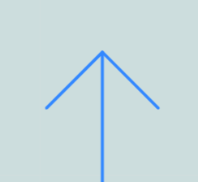
      </td>
   </tr>
   <tr>
      <td><pre>L.polyline([]).arrowheads({
  yawn: 40
})</pre></td>
      <td>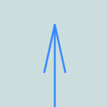</td>
      <td><pre>.arrowheads({
  yawn: 40,
  fill: true
})</pre></td>
      <td>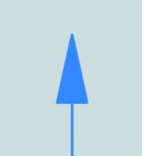</td>
   </tr>
</table>

<table>
   <tr>
      <td colspan="4"><b>Color and Fill Options</td>
   </tr>
   <tr>
      <td width="35%">
         <pre>L.polyline([]).arrowheads()</pre><br>
         (Standard options makes arrowheads a vector with same color as parent)
      </td>
      <td>
         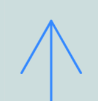
      </td>
      <td width="35%">
         <pre>L.polyline([]).arrowheads({
  fill: true
})</pre>
      </td>
      <td>
         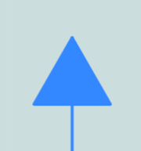
      </td>
   </tr>
   <tr>
      <td><pre>L.polyline([]).arrowheads({
  color: 'black'
})</pre></td>
      <td></td>
      <td><pre>L.polyline([],{
  color: 'black'
})
    .arrowheads({
       fill: true
    })</pre></td>
      <td>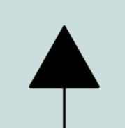</td>
   </tr>
   <tr>
      <td><pre>L.polyline([]).arrowheads({
  color: 'black'
})</pre></td>
      <td>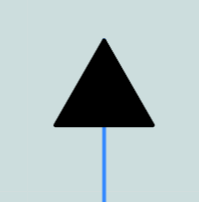</td>
      <td><pre>L.polyline([]).arrowheads({
  fill: true,
  color: 'black'
  fillColor: 'green'
})</pre></td>
      <td>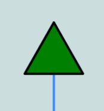</td>
   </tr>
</table>

<table width="2000px">
    <tr>
     <td colspan="2"><b>Size Options</b></td>
   </tr>
   <tr>
      <td colspan="2">Setting size to a number or percent will give you a fixed size arrowhead (in meters or percent of the size of the segment, respectively), regardless of zoom size.  See the frequency examples below for a better idea.</td>
   </tr>
   <tr>
      <td>
         <pre>L.polyline([coords]).arrowheads({size: '20px', fill: true})</pre>
      </td>
      <td>
         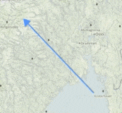
      </td>
   </tr>
</table>


<table>
   <tr><td><b>Frequency Options</b></td></tr>
   <tr><td>    
      <code>L.polyline([coords], {smoothFactor: 5}).arrowheads( {frequency: 'allvertices'} )  
      // standard option</code><br>
      <br>
      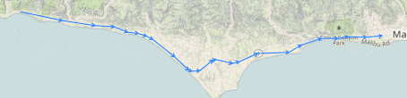
   </td></tr>
   <tr><td>    
      <code>L.polyline([coords]).arrowheads( {frequency: 'endonly', size: '50%'} )</code><br>
      <br>
      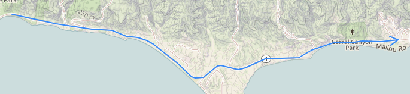
   </td></tr>
   <tr><td>
      <code>L.polyline([coords]).arrowheads( {frequency: 20} ) // 20 arrowheads evenly distributed</code><br>
      <br>
      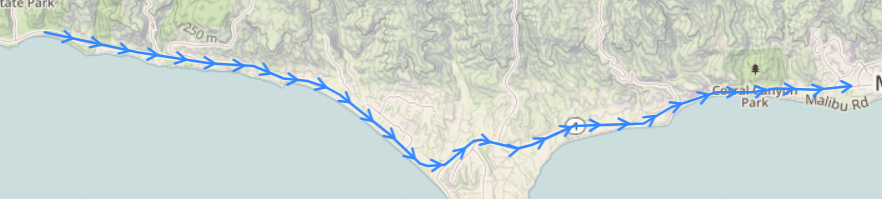
   </td></tr>
   <tr><td>
      <code>L.polyline([coords]).arrowheads( {frequency: '500m'} ) // arrowheads every ~500 m evenly distributed</code><br>
      <br>
      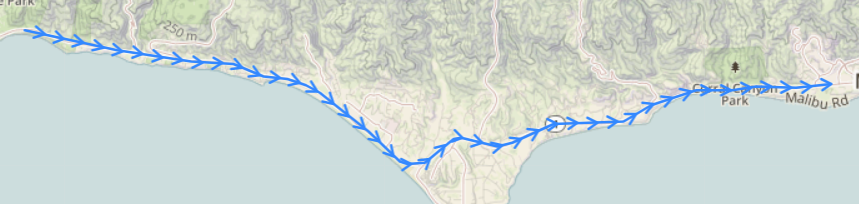
   </td></tr>
   <tr><td>    
      <code>L.polyline([coords]).arrowheads( {frequency: '50px', size: '12px'} ) // arrowheads every 50px regardless of zoom</code><br>
      <br>
      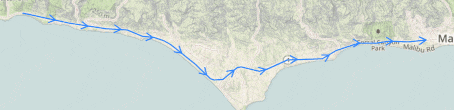
   </td></tr>
</table>

## Alternatives

After writing this plugin I discovered [Leaflet.PolylineDecorator](https://github.com/bbecquet/Leaflet.PolylineDecorator).  This offers some great methods to decorate your lines, potentially with arrowheads.  

## Limitations

Arrowheads sometimes look like they're in slightly the wrong orientation in areas of high curvature.  This is because of the way leaflet-arrowheads chooses and interpolates the points that it uses to calculate bearings.  This may be able to be improved.  Feel free to contribute / open a PR.

***New Bug / TODO:*** Applying option `frequency` or anything other than default occsionally renders the arrowheads *backwards* for polylines with many vertices, especially at lower zoom levels.  This is likely also because of the interpolations.  Either this is some new bug that arose, or I didn't notice it before.  Need to fix this asap.
